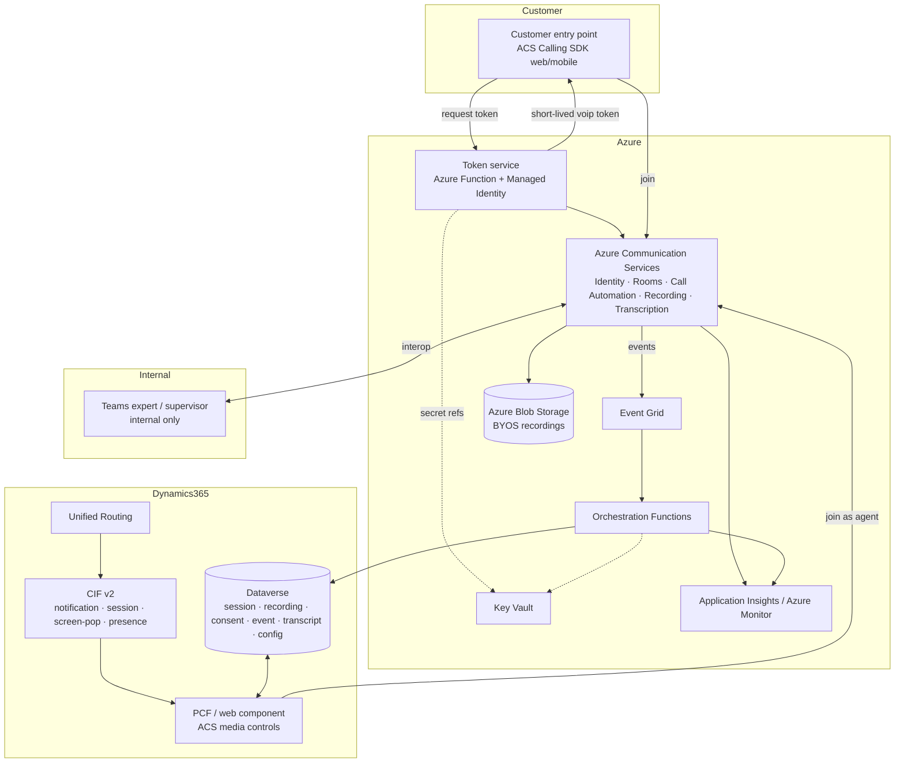

# Architecture

> **Version:** 0.1.0 · **Status:** Design baseline for the foundation phase.
> Confidence tags: **[Confirmed]** (Microsoft Learn), **[Likely]** (re-verify), **[Assumption]** (validate),
> **[Validate with Microsoft]** (explicit confirmation needed before production).

This document describes the end-to-end architecture of the custom ACS-based Audio & Video channel
for Dynamics 365 Contact Center. It is derived from the approved solution proposal.

---

## 1. Design principle (core flow)

> Customer entry point → **Azure Communication Services** → **ACS Room / call session** →
> **routing and agent assignment** → **Dynamics 365 agent workspace** →
> **embedded ACS media experience** → **recording and transcription** →
> **Azure Blob Storage** → **Dataverse metadata and case linkage** → **reporting and supervision**.

The customer-to-agent media path **always stays on ACS**. Teams is used only for internal
expert/supervisor collaboration via ACS↔Teams interop.

---

## 2. Logical component diagram

---

## 3. Separation of concerns

| Layer | Responsibility | Notes |
|---|---|---|
| **ACS** | Audio, video, screen share, recording, transcription, call/session control | Real-time media foundation **[Confirmed]** |
| **CIF v2** | Workspace orchestration: notification, session tab, screen-pop, presence | **Not** a media layer **[Confirmed — live]** |
| **PCF / web component** | The actual in-workspace media UI and call controls | Custom build against ACS Calling SDK **[Confirmed]** |
| **Dataverse** | Session, consent, recording, transcript, config, case-linkage metadata | Custom tables (prefix `alex`) |
| **Azure Functions / APIs** | Lifecycle coordination across ACS, D365, Dataverse, storage | Token service + orchestration |
| **Azure Blob (BYOS)** | Durable, org-owned recording storage + retention | Private containers, lifecycle/WORM |
| **Event Grid** | React to ACS events (`RecordingFileStatusUpdated`, call lifecycle) | Triggers Functions |
| **App Insights / Monitor** | Diagnostics, quality, error tracking | Operational visibility |
| **Teams** | Internal expert/supervisor collaboration only | Customer never moves to Teams |

---

## 4. ACS layer

| Component | Role | Confidence |
|---|---|---|
| ACS Identity | Per-customer identities (authenticated → mapped to CRM; anonymous → ephemeral) | [Confirmed] |
| Token issuance & refresh | Trusted token service issues short-lived `voip` tokens; SDK `tokenRefresher` | [Confirmed] |
| ACS Calling SDK | Web (JS) + iOS/Android: audio, video, screen share, mute/hold, diagnostics | [Confirmed] |
| ACS Rooms | Per-session isolation and roles (Presenter/Attendee/Consumer); validity window | [Confirmed] |
| ACS Call Automation | Server-side answer/create, add/remove participant, transfer, play/TTS, DTMF | [Confirmed] |
| ACS Call Recording | Start/stop/pause/resume; mixed/unmixed; mp3/wav/mp4; BYOS | [Confirmed — live] |
| Real-time transcription / media streaming | Live transcription over WebSocket; raw audio for AI | [Confirmed] |
| Event Grid events | `RecordingFileStatusUpdated`, call lifecycle → Functions | [Confirmed] |
| Teams interoperability | Add an internal Teams expert into the customer's ACS session | [Confirmed — live] |

### Participant roles
| Role | ACS treatment | Capability |
|---|---|---|
| Customer | Ephemeral/authenticated identity, Room **Attendee** | Audio/video/screen-share send+receive |
| Agent | Identity mapped to Entra user, Room **Presenter** | Full media + screen share |
| Supervisor | Identity, Room **Consumer** (muted) for monitor; promote for barge | Silent monitor / optional barge |
| Internal expert | ACS or Teams user via interop | Consult; no extra customer-data exposure |

---

## 5. Dynamics 365 integration

- **CIF v2** provides workspace hooks: incoming notification (`notifyEvent`), session tab
  (`createSession`), screen-pop (`searchAndOpenRecords` / `createTab`), presence
  (`setPresence`/`getPresence`). **[Confirmed — live]**
- The **native first-party communication panel cannot be fully reused**; media controls are a
  **custom PCF / web component** hosting the ACS Calling SDK. **[Confirmed]**
- CIF v2 does **not** auto-create a native Omnichannel conversation or consume capacity. **[Confirmed — live]**

See [known-limitations.md](known-limitations.md) for the full native-vs-custom matrix.

---

## 6. Data & orchestration

- **Dataverse** custom tables hold session, recording, consent, event/telemetry, transcript, and
  channel configuration metadata, linked to `contact`, `account`, `incident` (case), `phonecall`
  activity, `systemuser`, and `queue`. See [configuration-model.md](configuration-model.md).
- **Azure Functions** coordinate the lifecycle: token issuance, Room creation, routing trigger,
  recording control, metadata writes, cleanup.
- **Event Grid** drives reactive metadata writes (e.g., on `RecordingFileStatusUpdated`).

---

## 7. Security architecture (summary)

- Agent identity via **Entra ID**; backend via **Managed Identity**; customer via **short-lived ACS tokens**.
- **No secrets in the client.** ACS connection strings/keys never reach the browser.
- **Key Vault** for secrets; **Customer-Managed Keys** where required.
- TLS 1.2+ signaling; SRTP/DTLS-SRTP media; AES-256 at rest.
- Recording access via RBAC + scoped, time-limited retrieval; private blob containers.

Full detail in [security-and-compliance.md](security-and-compliance.md).

---

## 8. Session lifecycle (high level)

create Room → add customer → create pending Dataverse session → route/assign → add agent →
start recording (post-consent) → capture events → stop recording → finalize storage →
write metadata/transcript/summary → close session and clean up ephemeral identity.

A detailed sequence will be documented in `session-lifecycle.md` during Phase 4.

---

## 9. Open architectural questions

Tracked in [known-limitations.md](known-limitations.md) and [implementation-plan.md](implementation-plan.md):
routed work-item attachment, capacity consumption, WebRTC-in-iframe support, Quality Management
consumption of custom recordings, supervisor reuse, and licensing — all **[Validate with Microsoft]**.
