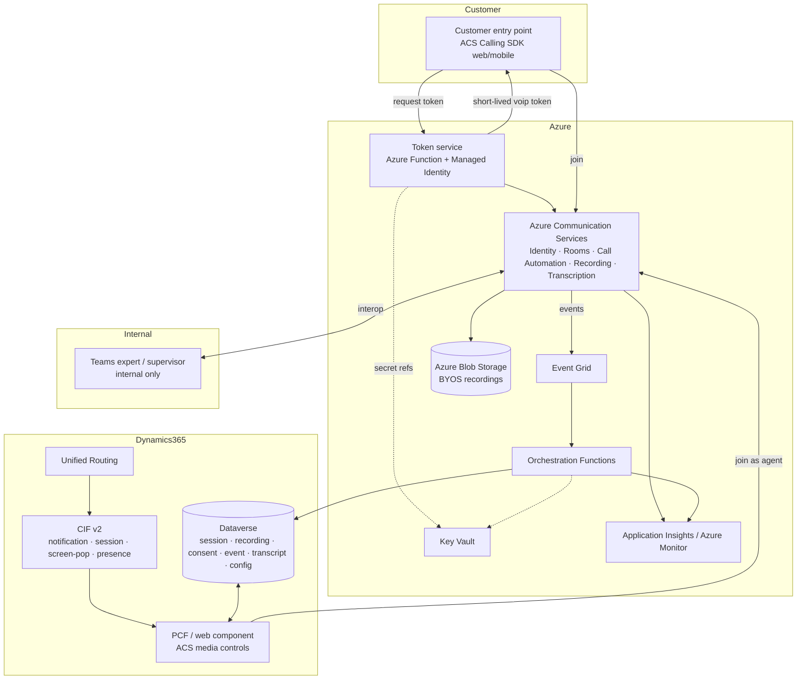

# Architecture

> **Version:** 0.1.0 · **Status:** Design baseline for the foundation phase.
> Confidence tags: **[Confirmed]** (Microsoft Learn), **[Likely]** (re-verify), **[Assumption]** (validate),
> **[Validate with Microsoft]** (explicit confirmation needed before production).

This document describes the end-to-end architecture of the custom ACS-based Audio & Video channel
for Dynamics 365 Contact Center. It is derived from the approved solution proposal.

---

## 1. Design principle (core flow)

> Customer entry point → **Azure Communication Services** → **ACS Room / call session** →
> **routing and agent assignment** → **Dynamics 365 agent workspace** →
> **embedded ACS media experience** → **recording and transcription** →
> **Azure Blob Storage** → **Dataverse metadata and case linkage** → **reporting and supervision**.

The customer-to-agent media path **always stays on ACS**. Teams is used only for internal
expert/supervisor collaboration via ACS↔Teams interop.

---

## 2. Logical component diagram

---

## 3. Separation of concerns

| Layer | Responsibility | Notes |
|---|---|---|
| **ACS** | Audio, video, screen share, recording, transcription, call/session control | Real-time media foundation **[Confirmed]** |
| **CIF v2** | Workspace orchestration: notification, session tab, screen-pop, presence | **Not** a media layer **[Confirmed — live]** |
| **PCF / web component** | The actual in-workspace media UI and call controls | Custom build against ACS Calling SDK **[Confirmed]** |
| **Dataverse** | Session, consent, recording, transcript, config, case-linkage metadata | Custom tables (prefix `alex`) |
| **Azure Functions / APIs** | Lifecycle coordination across ACS, D365, Dataverse, storage | Token service + orchestration |
| **Azure Blob (BYOS)** | Durable, org-owned recording storage + retention | Private containers, lifecycle/WORM |
| **Event Grid** | React to ACS events (`RecordingFileStatusUpdated`, call lifecycle) | Triggers Functions |
| **App Insights / Monitor** | Diagnostics, quality, error tracking | Operational visibility |
| **Teams** | Internal expert/supervisor collaboration only | Customer never moves to Teams |

---

## 4. ACS layer

| Component | Role | Confidence |
|---|---|---|
| ACS Identity | Per-customer identities (authenticated → mapped to CRM; anonymous → ephemeral) | [Confirmed] |
| Token issuance & refresh | Trusted token service issues short-lived `voip` tokens; SDK `tokenRefresher` | [Confirmed] |
| ACS Calling SDK | Web (JS) + iOS/Android: audio, video, screen share, mute/hold, diagnostics | [Confirmed] |
| ACS Rooms | Per-session isolation and roles (Presenter/Attendee/Consumer); validity window | [Confirmed] |
| ACS Call Automation | Server-side answer/create, add/remove participant, transfer, play/TTS, DTMF | [Confirmed] |
| ACS Call Recording | Start/stop/pause/resume; mixed/unmixed; mp3/wav/mp4; BYOS | [Confirmed — live] |
| Real-time transcription / media streaming | Live transcription over WebSocket; raw audio for AI | [Confirmed] |
| Event Grid events | `RecordingFileStatusUpdated`, call lifecycle → Functions | [Confirmed] |
| Teams interoperability | Add an internal Teams expert into the customer's ACS session | [Confirmed — live] |

### Participant roles
| Role | ACS treatment | Capability |
|---|---|---|
| Customer | Ephemeral/authenticated identity, Room **Attendee** | Audio/video/screen-share send+receive |
| Agent | Identity mapped to Entra user, Room **Presenter** | Full media + screen share |
| Supervisor | Identity, Room **Consumer** (muted) for monitor; promote for barge | Silent monitor / optional barge |
| Internal expert | ACS or Teams user via interop | Consult; no extra customer-data exposure |

---

## 5. Dynamics 365 integration

- **CIF v2** provides workspace hooks: incoming notification (`notifyEvent`), session tab
  (`createSession`), screen-pop (`searchAndOpenRecords` / `createTab`), presence
  (`setPresence`/`getPresence`). **[Confirmed — live]**
- The **native first-party communication panel cannot be fully reused**; media controls are a
  **custom PCF / web component** hosting the ACS Calling SDK. **[Confirmed]**
- CIF v2 does **not** auto-create a native Omnichannel conversation or consume capacity. **[Confirmed — live]**

### 5.1 Agent media component (scaffold — Phase 3c)

The agent media controls are built as a **framework-neutral web component** with a strict
abstraction boundary (`IMediaSession`) between the UI and the future ACS Calling SDK
(`src/agent-media-panel/`). Phase 3c ships the **UI + abstraction in mock mode only** — it is
**local-only and not registered or imported into Dynamics 365**.

- The same UI and `IMediaSession` boundary can later be **wrapped as a PCF control** (`pac pcf init`)
  or hosted as a **web resource** when embedding is approved — see
  [ADR-0008](adr/0008-agent-media-component-approach.md).
- `RealMediaSession` (ACS Calling SDK) is a documented placeholder that throws until ACS is approved.
- Recording and consent are **server-authoritative** (token service + Event Grid); the panel renders
  them, it does not own them.
- Browser/iframe Permissions-Policy for camera/mic/screen-share in the D365 host is an open
  validation item — see [known-limitations.md](known-limitations.md).

### 5.2 Panel hosting model (POC vs. production)

| Aspect | POC (current) | Target (production) |
|---|---|---|
| Host | **GitHub Pages** — `https://alexander-you.github.io/dynamics-365-ccaas-audio-video-channel/` | **Azure-based** static hosting |
| Status | **Temporary POC hosting only** | **Intended production model** |
| Build | `VITE_USE_MOCKS=true` (mock media, no ACS/Dataverse calls) | Production bundle with `RealMediaSession` |
| Options | — | **Azure Static Web Apps** (preferred), **Azure App Service**, or **Azure Storage static website** — chosen per final requirements |

> **GitHub Pages is approved only as temporary POC hosting and must not be positioned as the target
> production hosting model.** Production hosting of the agent media panel should be **Azure-based**
> (preferably **Azure Static Web Apps**, otherwise **Azure App Service** or **Azure Storage static
> website**), aligned with the rest of the Azure footprint (ACS, Functions, storage) for identity,
> network controls, custom domain, and governance.

See [known-limitations.md](known-limitations.md) for the full native-vs-custom matrix.

### 5.3 What “provider surfacing” validates — and what it does **not**

> **CIF v2 provider/widget surfacing is not the same as a native routed Dynamics 365 conversation.**
> Attaching a CIF v2 Channel Provider to an app profile only makes the custom widget **available to
> load** in the workspace for users on that profile. It does **not** create a workstream, queue,
> routing rule, Dataverse session schema, or a real work item, and it does **not** produce a native
> inbox conversation, chat/voice transcript, capacity consumption, or customer-summary population.

At the current stage (CIF provider attached to a profile + test user on that profile + mock panel on
the POC host), the **only** validatable behaviors are:

| # | In scope to validate now | Notes |
|---|---|---|
| 1 | CIF v2 provider is attached to the selected app profile | Dataverse N:N association |
| 2 | The approved test user receives that app profile | one app profile per user |
| 3 | The custom **Audio/Video (POC)** widget can load in the workspace side pane / communication area | iframe surfacing |
| 4 | The GitHub Pages mock panel embeds successfully | HTTPS, no frame-deny headers |
| 5 | The panel can detect `Microsoft.CIFramework` when loaded inside the workspace | else standalone fallback |
| 6 | The mock UI runs in standalone/mock mode | `VITE_USE_MOCKS=true` |
| 7 | A “simulate incoming interaction” action *may* call CIF APIs (`notifyEvent`/`createSession`) | **simulation only**, not a routed conversation |

**Explicitly out of scope at this stage:** real inbox conversation, native Omnichannel work item,
native chat/voice transcript, native routing, queue assignment, capacity consumption, native customer
summary from a real conversation, and any real ACS call or recording.

> **Correct status wording:** *“The CIF v2 provider and mock media widget are available for workspace
> integration validation.”* Not *“a working custom channel.”*

The next real milestone is one of: **(A)** a controlled mock/simulated CIF interaction flow
(notification → accept/reject → session open); **(B)** a record-based workstream using an Audio/Video
Session Dataverse record; or **(C)** a Custom Messaging / BYOC bootstrap that creates a routed work
item and then launches the ACS media session.

---

## 6. Data & orchestration

- **Dataverse** custom tables hold session, recording, consent, event/telemetry, transcript, and
  channel configuration metadata, linked to `contact`, `account`, `incident` (case), `phonecall`
  activity, `systemuser`, and `queue`. See [configuration-model.md](configuration-model.md).
- **Azure Functions** coordinate the lifecycle: token issuance, Room creation, routing trigger,
  recording control, metadata writes, cleanup.
- **Event Grid** drives reactive metadata writes (e.g., on `RecordingFileStatusUpdated`).

---

## 7. Security architecture (summary)

- Agent identity via **Entra ID**; backend via **Managed Identity**; customer via **short-lived ACS tokens**.
- **No secrets in the client.** ACS connection strings/keys never reach the browser.
- **Key Vault** for secrets; **Customer-Managed Keys** where required.
- TLS 1.2+ signaling; SRTP/DTLS-SRTP media; AES-256 at rest.
- Recording access via RBAC + scoped, time-limited retrieval; private blob containers.

Full detail in [security-and-compliance.md](security-and-compliance.md).

---

## 8. Session lifecycle (high level)

create Room → add customer → create pending Dataverse session → route/assign → add agent →
start recording (post-consent) → capture events → stop recording → finalize storage →
write metadata/transcript/summary → close session and clean up ephemeral identity.

A detailed sequence will be documented in `session-lifecycle.md` during Phase 4.

---

## 9. Screen sharing vs co-browsing

These are **two different capabilities** and are scoped differently:

| Capability | In MVP? | Mechanism | Notes |
| --- | --- | --- | --- |
| **Screen sharing** | **Yes** | Native ACS Calling SDK screen-share (the participant streams a window/screen as video) | Already represented in the role/permission model (Presenter/Attendee). One party shares pixels; the other views. **[Confirmed]** |
| **Co-browsing** | **No (future)** | A separate, custom DOM-synchronisation module | True co-browsing (shared, interactive control of the same web page with field-level masking) is **not** part of the MVP. |

> **Co-browsing is intentionally out of MVP scope.** It should be documented and built later as a
> **custom module**, not assumed to be provided by ACS screen sharing.

### Future co-browsing design considerations (not implemented)

When co-browsing is taken on as a future workstream, evaluate a real-time transport such as
**Azure Web PubSub** or **Azure Fluid Relay** to synchronise DOM/scroll/input state between
customer and agent. The design **must** include:

- **Consent** captured and persisted (Dataverse) before a co-browse session starts.
- **Field masking** of sensitive inputs (passwords, payment data, PII) on the shared surface.
- **Audit trail** of who initiated, joined, and ended each co-browse session.
- **Dataverse linkage** of the co-browse session to the conversation/case, consistent with the
  recording/transcript metadata model.

This is captured as a future item in [known-limitations.md](known-limitations.md).

---

## 10. Open architectural questions

Tracked in [known-limitations.md](known-limitations.md) and [implementation-plan.md](implementation-plan.md):
routed work-item attachment, capacity consumption, WebRTC-in-iframe support, Quality Management
consumption of custom recordings, supervisor reuse, and licensing — all **[Validate with Microsoft]**.
