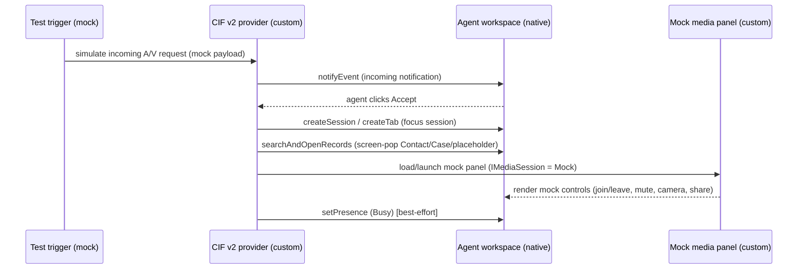

# Dynamics 365 Agent Workspace Integration (Phase 4A — Planning Only)

> **Version:** 0.1.0 · **Status:** PLANNING ONLY — **no Dynamics 365 / Power Platform changes have
> been made.** This document describes the *proposed* integration of the **mock** agent media panel
> into the Dynamics 365 agent workspace.
> **Approval gate:** Nothing in this document is implemented until the user confirms the target
> environment, solution, publisher, prefix, app profile, and that changes are allowed. See
> [d365-pre-change-checklist.md](d365-pre-change-checklist.md).

Related: [cif-v2-configuration.md](cif-v2-configuration.md) ·
[d365-workstream-and-channel-strategy.md](d365-workstream-and-channel-strategy.md) ·
[channel-configuration-model.md](channel-configuration-model.md) ·
[ADR-0008](adr/0008-agent-media-component-approach.md) · [architecture.md](architecture.md) §5.

---

## 1. Goal of Phase 4A

Validate the **agent experience** of the custom ACS Audio/Video channel **inside a real Dynamics 365
development/sandbox environment**, using **CIF v2** and a **hosted mock media panel**. The media layer
stays in **mock mode** — no real ACS tokens, no ACS calls, no Azure provisioning, no recordings.

The questions Phase 4A answers:

1. Can the **mock** Audio/Video agent panel be launched inside the agent workspace?
2. Can **CIF v2** raise an incoming notification?
3. Can the agent **accept / reject**?
4. Can the workspace **open or focus a session**?
5. Can we **screen-pop** to a Contact, Case, or placeholder Audio/Video Session context?
6. Does the experience **feel integrated** enough for an agent?
7. What is **native** Dynamics behavior vs **custom** behavior?

---

## 2. Target workspace apps

The custom channel is intended for a model-driven **agent workspace** app:

- **Customer Service workspace** (`CustomerServiceWorkspace`), or
- **Contact Center workspace** (the CCaaS first-party workspace).

For the POC we use **one** workspace app in the dev/sandbox environment with a **dedicated POC app
profile** (not a production profile). The exact app and profile are confirmed before any change — see
[d365-pre-change-checklist.md](d365-pre-change-checklist.md).

---

## 3. How the panel is hosted (POC direction)

**Recommended for the first POC: a hosted web component / web resource, not PCF (yet).**

| Option | What it is | POC fit |
|---|---|---|
| **Hosted web component** (recommended) | The existing `src/agent-media-panel` web component served from a URL and surfaced in the workspace via the **CIF v2 channel panel** and/or an app **session tab** | ✅ Fastest to validate; no Dataverse customization; reuses Phase 3c as-is |
| **Web resource** | The same bundle uploaded as an HTML+JS Dataverse **web resource** and referenced from a tab/sub-grid | ◯ Possible; requires solution web-resource registration |
| **PCF control** | The same UI wrapped as a Power Apps Component Framework control bound to a form/field | ⛔ Deferred — only if planning shows a form-binding/lifecycle need. See [ADR-0008](adr/0008-agent-media-component-approach.md) |

> **Why not PCF yet:** PCF adds a solution component, a control manifest, and a form/field binding
> that the POC does not need to answer its core questions. The `IMediaSession` boundary means the
> *same* UI can be wrapped as PCF later with no rewrite. We only adopt PCF when a concrete requirement
> (form binding, dataset binding, lifecycle hooks) appears.

> **Update (2026-05-31) — media-publishing surface decision.** Live testing confirmed that the
> hosted panel **cannot publish camera/microphone** when surfaced as a **cross-origin Application Tab
> (Third-Party Website)** — `getUserMedia` is blocked by the iframe Permissions Policy
> (`NotAllowedError`). The control surface (notification, presence, controls) still works via CIF, but
> the **media-publishing** part must move to a **same-origin / in-DOM** surface. A read-only spike
> ([workspace-media-surface-spike.md](workspace-media-surface-spike.md)) recommends: **HTML web
> resource** as the cheapest same-origin capture probe, then **PCF code component** as the target
> (runs in the host DOM/origin, bundles the ACS SDK), pending Microsoft validation of the workspace
> page's document-level Permissions-Policy. The **pop-out window is rejected** as the agent UX (kept
> only as a `?debug=1` diagnostic). This reorders the table below: a web resource / PCF is now the
> media path, not merely an alternative.
>
> **Follow-up (2026-05-31) — same-origin probe deployed.** A minimal, unbound HTML web resource
> `alex_acv_capture_probe.html` was created in **Demo Contact Center EN** (solution
> `alex_visual_engagement_channel`) to empirically test whether a same-origin Dynamics surface gets
> document-level camera/microphone permission. It runs a guarded `getUserMedia` that stops tracks
> immediately, makes no ACS/Dataverse/storage/token calls, and is bound to nothing. **Live result is
> pending** — see [workspace-media-surface-spike.md §11](workspace-media-surface-spike.md) for the two
> safe test URLs (app-shell and top-level), the result table, and one-step rollback.

### 3.1 The CIF v2 channel panel vs an app session tab

- **CIF v2 channel panel** — the side panel that CIF providers render into. Good for **call controls,
  incoming notification, and presence**. This is where the *control surface* lives.
- **App session tab / app tab** — a workspace tab opened for a session (via `Microsoft.Apps.createTab`
  / session templates). Good for a **larger media stage** (video tiles, screen share) and context.

The POC can use the channel panel for controls and optionally an app tab for the larger media stage.
Both are described in [cif-v2-configuration.md](cif-v2-configuration.md).

---

## 4. Native vs custom — responsibility split

| Capability | Native Dynamics 365 | CIF v2 integration | Custom (this project) | Remains mock (Phase 4A) |
|---|---|---|---|---|
| Workspace shell, multi-session bar, tabs | ✅ | — | — | — |
| Incoming notification UI | ✅ (rendered by host) | ✅ (raised via `notifyEvent`) | trigger source is mock | ✅ mock trigger |
| Accept / reject buttons | ✅ (host renders) | ✅ (CIF notification template) | accept/reject handler | ✅ mock outcome |
| Create / focus session tab | ✅ | ✅ (`createSession` / `createTab`) | session metadata is mock | ✅ |
| Screen-pop to Contact/Case | ✅ | ✅ (`searchAndOpenRecords`) | placeholder A/V Session context is mock | ✅ |
| Presence get/set | ✅ | ✅ (`setPresence`/`getPresence`) | coordination logic | ✅ best-effort |
| Media controls (mute/camera/share) | ⛔ not reusable | hosts the panel | **custom agent media panel** | ✅ `MockMediaSession` |
| Real audio/video media | ⛔ | ⛔ | **future** `RealMediaSession` (ACS) | ⛔ not in 4A |
| Recording / consent enforcement | ⛔ | ⛔ | **future** server-authoritative | ⛔ not in 4A |
| Routing / work distribution | ✅ Unified Routing | ⛔ (CIF ≠ routing) | **future** strategy | ⛔ not in 4A |

> **Key clarification:** CIF v2 is a **workspace UI integration layer**, not a routing or capacity
> mechanism. It does **not** create a native Omnichannel conversation or consume capacity by itself.
> Routing/capacity is a separate concern — see
> [d365-workstream-and-channel-strategy.md](d365-workstream-and-channel-strategy.md).

---

## 5. POC interaction flow (all mock)

No network calls leave the workspace except loading the static panel bundle; the panel runs
`MockMediaSession` (`VITE_USE_MOCKS=true`).

---

## 6. What Phase 4A explicitly does **not** do

- No real ACS tokens, ACS calls, or media; no Azure provisioning; no recordings.
- No **full** Dataverse schema (a single optional placeholder table may be proposed for screen-pop
  context but is **not** created without separate approval — see
  [channel-configuration-model.md](channel-configuration-model.md) and the checklist).
- No production app profile, no managed solution, no real routing/workstream/queue/capacity.
- No PCF packaging unless a documented need emerges.

---

## 7. Exit criteria for Phase 4A Part 2 (after approval)

The POC is considered successful if, in the dev/sandbox workspace, an agent can: receive a (mock)
incoming notification → accept → land in a focused session → see a screen-pop context → operate the
mock media panel controls — and the flow feels like part of the normal workspace. Findings (native
vs custom gaps, iframe permission behavior, presence reliability) are recorded back into
[known-limitations.md](known-limitations.md).
