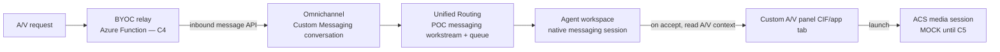

# Workstream & Channel Strategy for the Custom ACS A/V Channel (Phase 4A — Planning Only)

> **Version:** 0.1.0 · **Status:** PLANNING ONLY — **no workstream, queue, routing rule, or capacity
> profile has been created.** This document evaluates *how* the custom channel should relate to
> Dynamics 365 routing, and recommends a model to validate.
> **Approval gate:** No routing configuration is created until separately approved. See
> [d365-pre-change-checklist.md](d365-pre-change-checklist.md).

Related: [cif-v2-configuration.md](cif-v2-configuration.md) ·
[d365-agent-workspace-integration.md](d365-agent-workspace-integration.md) ·
[channel-configuration-model.md](channel-configuration-model.md).

---

## 1. The core constraint

> **There is no native, standalone "custom real-time audio/video" workstream type in Dynamics 365.**

Unified Routing ships workstream **channel types** for **Messaging**, **Voice (Azure
Communication Services telephony)**, **Record**, and **Case/Entity**. A bring-your-own **real-time
A/V** channel is **not** a first-class workstream channel type. CIF v2 (the workspace integration) is
**not** a routing mechanism and does **not** create a routable work item or consume capacity by
itself.

Therefore the work item that represents an incoming A/V request must be **bootstrapped** into a
routing-capable shape. Three candidate models are evaluated below; **Phase 4A validates the workspace
experience first and does not implement routing.**

---

## 2. Candidate routing models

### Model A — Record-based workstream (recommended to validate first)

Create an **Audio/Video Session** Dataverse record (`alex_acvsession`) when a request arrives; a
**Record** workstream routes that record to a queue/agent using Unified Routing.

| Aspect | Detail |
|---|---|
| Work item | A Dataverse row (`alex_acvsession`) |
| Routing | **Record-based routing** workstream → queue → assignment |
| Capacity | Standard capacity/units via the workstream/capacity profile |
| Skills/priority | Native (attributes on the record drive skill/priority rules) |
| Pros | Uses native Unified Routing, capacity, skills, assignment, reporting; auditable |
| Cons | Requires the `alex_acvsession` **table** (deferred — schema approval needed) |
| Fit | **Best native alignment**; recommended target once schema is approved |

### Model B — Custom Messaging / BYOC bootstrap

Use a **Custom Messaging (BYOC)** channel to create a conversation/work item that, on accept,
**launches the ACS media session** (the message thread is the routing carrier; media rides alongside
via the custom panel).

| Aspect | Detail |
|---|---|
| Work item | A messaging conversation (custom/BYOC) |
| Routing | Native **Messaging** workstream → queue → assignment |
| Capacity | Messaging capacity model |
| Pros | Real conversation object, presence, capacity, reporting; agent gets a familiar messaging session that "upgrades" to A/V |
| Cons | Conceptual mismatch (A/V represented as a message thread); BYOC bootstrap/maintenance; more moving parts |
| Fit | Viable alternative if a conversation object is desired before media |

### Model C — External ACS Job Router (fallback only)

Route entirely **outside** Dynamics using **ACS Job Router**; Dynamics only **reflects** assignment
via CIF v2 (notification + screen-pop), not native routing.

| Aspect | Detail |
|---|---|
| Work item | ACS Job Router job (outside Dataverse) |
| Routing | ACS Job Router (queues, workers, distribution policies) |
| Capacity | Managed in ACS, **not** Dynamics capacity |
| Pros | Fully decoupled; flexible; no Dataverse routing dependency |
| Cons | **Bypasses** native Unified Routing, capacity, skills, reporting, supervisor tooling; duplicate worker/agent modeling; weaker D365 integration |
| Fit | **Fallback only** — use if routing must live outside Dynamics |

---

## 3. Recommendation

| Decision | Recommendation |
|---|---|
| **Phase 4A (now)** | Validate **workspace experience only** (CIF v2). **No routing.** Trigger is mock. |
| **Primary target model** | **Model A — Record-based workstream** on `alex_acvsession` (after schema approval) |
| **Alternative** | **Model B — Custom Messaging / BYOC** if a conversation object is required up front |
| **Fallback** | **Model C — ACS Job Router** only if routing is deliberately handled outside Dynamics |

Rationale: Model A keeps **routing, capacity, skills, assignment, and reporting native** to Dynamics,
which maximizes supervisor/reporting reuse and minimizes parallel infrastructure. It depends only on a
small custom table, which is approved separately.

---

## 4. How each Unified Routing concept maps (target = Model A)

| Concept | Native role | Custom A/V mapping (future) |
|---|---|---|
| **Workstream** | Entry point + routing config | **Record** workstream bound to `alex_acvsession` |
| **Queue** | Pool of agents | A/V queue(s); `alex_queueid` on channel config |
| **Unified Routing** | Classification + assignment | Rulesets on `alex_acvsession` attributes |
| **Capacity** | Concurrency control | Capacity profile; `alex_videocapacitycost` units per session |
| **Skills** | Match work to ability | Skill attributes on the session record (e.g., language, product) |
| **Assignment rules** | Pick the agent | Native assignment methods on the workstream |
| **Record-based routing** | Route Dataverse rows | The mechanism for Model A |
| **Custom Messaging / BYOC** | Bring external messaging | The mechanism for Model B |
| **ACS Job Router** | External distribution | The mechanism for Model C (fallback) |

---

## 5. Explicitly out of scope for Phase 4A

- No workstream, queue, routing ruleset, capacity profile, or skill is created.
- No `alex_acvsession` table is created in Part 1 (schema is a separate approval — see
  [channel-configuration-model.md](channel-configuration-model.md)).
- The incoming-request trigger is **mock**; no real signaling or distribution.
- The chosen routing model is **decided later**, after the workspace POC and schema approval.

> Findings from the POC (e.g., whether presence/session APIs behave well enough to support Model A vs
> Model B) feed the routing decision and are recorded in [known-limitations.md](known-limitations.md).

---

## 6. Option C — Custom Messaging / BYOC bootstrap: gated execution plan

> **Status:** APPROVED to plan and to validate via the **recommended path** (scripted inbound, mock
> media, isolated POC routing) in **Demo Contact Center EN only**. Each gate below is a separate,
> reversible step. Media stays **mock** through C1–C4; real ACS is C5 (separate approval).

> **Scope change acknowledgement:** Option C deliberately reverses the Phase 4A "no
> workstream/queue/routing/capacity" guardrail **for the POC org only**. It introduces a *real routed
> conversation* (and therefore real capacity consumption for the test agent). It does **not** introduce
> real ACS media until C5.

### 6.1 Target bootstrap shape

### 6.2 Environment discovery (read-only, 2026-05-30, Demo Contact Center EN)

| Finding | Value | Implication |
|---|---|---|
| Omnichannel provisioned | Yes (`Omnichannel Configuration` present) | Routing entities available |
| Custom Messaging channel **definition** | Exists (`msdyn_channeldefinition`, `type=Custom`) | BYOC channel type is registered |
| Existing **Custom messaging workstream** | `ee900829-d87c-40d2-b0dd-1bc6be067579`, `streamsource=192350002`, **no default queue** | Not reused (production + incomplete) |
| Custom Messaging channel **instance** | **None found** (only voice/LiveHub instances) | A credentialed inbound endpoint is **not** provisioned |
| Workstream stream-source for custom messaging | `192350002` | Value to set on a POC workstream |

> **Critical constraint discovered:** a Custom Messaging (BYOC) conversation can only be injected
> through a **registered channel instance** (with credentials + an inbound endpoint) calling the
> **Omnichannel inbound messaging runtime API** — this is **not** a plain Dataverse `POST`. The channel
> instance is created via the **Omnichannel admin center "Custom messaging" setup**, which provisions
> credentials and the inbound endpoint. Raw-REST creation of a working channel instance is **not**
> safely scriptable and is therefore **not** attempted.

### 6.3 Gates

| Gate | Action | Scriptable & reversible? | Approval |
|---|---|---|---|
| **C0** | Lock this design + record discovery (this section) | Yes (docs only) | ✅ done |
| **C1a** | Create POC **messaging workstream** (record), POC **queue**, **routing rule**, **capacity profile**; bind to the existing Custom channel definition | Mostly yes (Dataverse records) | needs go |
| **C1b** | Create the **Custom Messaging channel instance** (credentials + inbound endpoint) | **No — Omnichannel admin center UI** | needs go |
| **C2** | **Scripted inbound**: call the inbound messaging API with a mock A/V context to create a routed conversation | Yes (once C1b exists) | needs go |
| **C3** | On accept, panel reads conversation context and launches the **mock** media session; validate end-to-end | Yes | needs go |
| **C4** | Replace scripted inbound with an **Azure Function relay** (inbound + required outbound webhook) | Azure provisioning | separate approval |
| **C5** | Swap `MockMediaSession` → `RealMediaSession` (real ACS + token service) | Azure/ACS provisioning | separate approval |

### 6.4 Open decision (blocks C1b/C2)

Because the inbound path requires a credentialed channel **instance** that cannot be safely scripted:

- **Path C-i (admin-center instance):** the admin creates a **Custom Messaging channel instance** in the
  Omnichannel admin center; then the scriptable pieces (workstream/queue/routing/capacity) and the
  scripted inbound call can be completed. Most faithful to Option C.
- **Path C-ii (Model A substitute for now):** validate the *routed work item* end of Option C using a
  **record-based** workstream (fully scriptable: create a Dataverse record + Record workstream),
  deferring true BYOC messaging to when the Azure relay (C4) exists. Lower fidelity to "messaging
  conversation", but unblocks routed-conversation validation without manual provisioning.

> Until this decision is made and C1b is satisfied, **no routed conversation can be created**. The
> agent will not POST partial/broken Omnichannel provisioning via raw REST.

### 6.5 Decision (2026-05-30): **PAUSED — pending Azure prerequisites**

**Resolved:** proceed with **Path C-i (true BYOC)**, but it is **blocked** until Azure prerequisites
exist. The Omnichannel **Add account** wizard for a custom channel requires a **Microsoft app ID**, a
**Client secret**, a **Tenant ID**, and a **Callback endpoint** — i.e. an **Entra app registration** plus a
**deployed callback/relay endpoint**. These are the **C4** deliverables, so the channel instance (C1b)
cannot be created beforehand.

| Item | Status |
|---|---|
| Path chosen | **C-i (true BYOC / Custom Messaging)** |
| Blocking prerequisite | Azure **Entra app registration** (app ID + client secret + tenant ID) and a **deployed callback/relay endpoint** |
| Record-based substitute (Path C-ii) | **Declined** for now (no new `alex_acvsession` table, no routing created yet) |
| Current Option C state | **PAUSED — no routing/queue/capacity/channel-instance created** |

**Resume trigger:** Azure app registration + relay endpoint approved and provisioned. Then execute in
order: **C4** (stand up relay + register Entra app) → **C1b** (create the Custom Messaging channel
instance using those credentials in the admin center) → **C1a** (script POC workstream/queue/routing/
capacity) → **C2** (scripted inbound) → **C3** (panel reads context, launches **mock** media) → **C5**
(real ACS, separate approval).

> **No Dynamics 365 routing changes were made for Option C.** Provider/widget surfacing from Part 2
> remains the only live custom-channel configuration; media remains mock.
