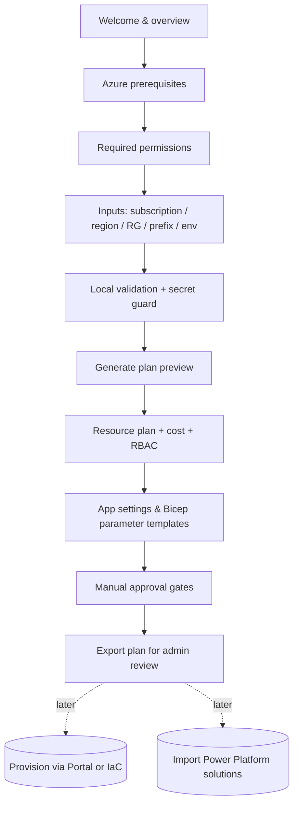

# Deployment Experience

> **Version:** 0.1.0 · **Phase:** 3.5 (deployment-experience design + scaffold). **Status:** concept
> + working local prototype. **No Azure or Dynamics 365 changes are made by anything described here.**
>
> Audience: solution architects and administrators. This document explains how a customer's
> administrator will eventually deploy and configure the custom Audio & Video channel in **their own
> tenant** — not just how a developer runs it locally.

## 1. Why this matters (and why Phase 3.5 exists)

Earlier phases optimized for the developer inner loop (mocks, local Functions, local web). But the
real deliverable must be deployable by an **administrator** who is not the author. Designing the
deployment experience *before* we provision real Azure resources or touch Dynamics 365 ensures that:

- Resource naming, RBAC, and configuration are designed for repeatable, multi-tenant deployment.
- Cost, permission, and approval gates are explicit and visible up front.
- The eventual managed/unmanaged Power Platform solutions and the Azure setup are coherent.
- We avoid building something that only the developer can deploy.

## 2. The three deployment surfaces

| Surface | Audience | What it deploys | Status |
| ------- | -------- | --------------- | ------ |
| **Deployment Assistant** (HTML wizard) | Administrator | Plans + guides Azure resource setup and configuration | Prototype (this phase) |
| **Power Platform solutions** (managed + unmanaged) | Administrator | Dataverse schema, CIF v2 channel provider, app config | Later phase |
| **Infrastructure-as-Code** (Bicep/parameters) | Administrator / DevOps | Repeatable Azure provisioning | Later phase (assistant previews parameters now) |

These are complementary: the **Deployment Assistant** orients the admin and produces a plan + config
templates; the **Power Platform solutions** carry the Dynamics-side artifacts; **IaC** makes the Azure
side repeatable.

## 3. The Deployment Assistant (HTML wizard)

A local, static web page (`src/deployment-assistant/`) that helps an administrator plan the
deployment. In this phase it is a **preview**: it collects inputs and renders a plan, but performs
**no provisioning** and makes **no API calls**.

### 3.1 What it helps with

1. Selecting or entering the Azure subscription (label + optional ID).
2. Selecting the target region.
3. Choosing or creating the resource group name.
4. Reviewing the naming convention.
5. Understanding which Azure resources will be created.
6. Preparing the ACS resource.
7. Preparing the Azure Function App.
8. Preparing Function runtime storage.
9. Preparing Azure Blob Storage for recordings (BYOS).
10. Preparing Event Grid configuration.
11. Preparing Application Insights + Log Analytics.
12. Preparing Key Vault (if used).
13. Explaining required Managed Identity and RBAC permissions.
14. Generating environment variables / app settings templates.
15. Generating `local.settings.json` / deployment parameter templates.
16. Showing which steps create cost.
17. Showing which steps require admin permissions.
18. Showing what must be done manually in the Azure Portal if automation is not used.
19. Preparing the later connection to Dynamics 365 and Dataverse.
20. Preparing the later import of managed and unmanaged Power Platform solutions.

### 3.2 What it explicitly does NOT do (this phase)

- It does **not** deploy, create, modify, or delete any Azure resource.
- It does **not** call Azure, ACS, Dynamics 365, or Dataverse APIs.
- It does **not** store or transmit secrets. It warns if a value looks like a secret.
- It contains **no** tenant-specific values; `.env.example` holds cosmetic defaults only.

### 3.3 Output

- A **deployment plan preview**: resource table (with proposed names), cost impact, required
  permissions, RBAC/Managed Identity explanation, app-settings template, example Bicep parameters,
  manual Portal steps, and **manual approval gates**.
- An exportable plain-text plan to review with the Azure administrator.

### 3.4 Flow

## 4. Azure resource setup (what the plan covers)

The assistant's resource catalog mirrors [azure-resources.md](azure-resources.md): resource group,
ACS, Function App, Functions runtime storage, recordings Blob (BYOS), Event Grid, Application
Insights, Log Analytics, and (optionally) Key Vault. For each resource the plan shows purpose,
proposed name, **cost level**, and the **permission** required to create it.

## 5. Dynamics 365 / Power Platform setup (later phases)

The assistant prepares — but does not execute — the Dynamics side:

- **Connection to Dynamics 365 / Dataverse:** environment URL, publisher, and `alex` prefix are
  confirmed by the admin (Phase 5/6). No connection is made in this phase.
- **Managed vs unmanaged solutions:**
  - *Unmanaged* — used during development/customization in a dev environment.
  - *Managed* — the shippable artifact imported into test/prod; components are locked to prevent
    accidental edits.
- The assistant will eventually link to the solution import step and surface the required admin role
  (System Customizer / Admin).

## 6. Required administrator decisions

| Decision | Needed for | Owner |
| -------- | ---------- | ----- |
| Subscription, resource group, region | Azure provisioning | Admin |
| Naming convention / prefix | All resources | Admin |
| Cost acceptance (ACS usage is the main driver) | Provisioning | Admin / Finance |
| RBAC / Managed Identity assignments | Runtime auth | Owner / User Access Administrator |
| Recording storage mode (Blob BYOS MVP default) | Compliance | Admin / Compliance |
| Retention period | Compliance | Admin / Compliance |
| Dynamics environment, publisher, prefix | Phase 5/6 | D365 Admin |
| Managed vs unmanaged import target | Phase 5/6 | D365 Admin |

## 7. MVP vs production hardening

| Area | MVP (this track) | Production hardening (later) |
| ---- | ---------------- | ---------------------------- |
| Recording storage | Blob BYOS, private container | Lifecycle policies, immutability, CMK |
| Secrets | Key Vault references | Private endpoints, rotation policy |
| Networking | Public endpoints | Private endpoints / VNet integration |
| Resilience | Single region | Multi-region DR |
| Identity | System-assigned Managed Identity | User-assigned MI, least-privilege custom roles |

## 8. Approval gates (must pass before any real deployment)

1. ✋ Azure subscription / RG / region / naming approved.
2. ✋ Cost reviewed and accepted.
3. ✋ RBAC / Managed Identity assignments approved.
4. ✋ Dynamics 365 environment, solution, publisher, prefix confirmed.
5. ✋ Managed/unmanaged solution import approved.

Until these are confirmed, the solution remains in scaffold/preview state and **nothing is
provisioned**.

## 9. Infrastructure as Code & helper scripts (Phase 3b — scaffold only)

In addition to manual Portal steps and the Deployment Assistant, the repository now ships a
**Bicep IaC scaffold** so an approved deployment can be one reviewable step:

- [`infra/bicep/main.bicep`](../infra/bicep/main.bicep) composes modules for ACS, Function App,
  storage, monitoring, Key Vault, Event Grid, and RBAC, using the documented naming convention.
- [`infra/bicep/parameters/dev.example.bicepparam`](../infra/bicep/parameters/dev.example.bicepparam)
  contains **placeholders only**. Copy it to a **git-ignored** `dev.bicepparam` and fill real
  values locally before deploying.
- [`scripts/generate-azure-plan.ps1`](../scripts/generate-azure-plan.ps1) **prints** the `az`
  commands (resource group, what-if, deploy) for review — it never provisions.
- [`scripts/validate-prerequisites.ps1`](../scripts/validate-prerequisites.ps1) performs **read-only**
  local tool/version checks.

The Deployment Assistant now also generates **example `az` CLI commands** (each flagged read-only
vs state-changing), a **cost warning summary**, and a **pre-deployment approval checklist**.

> **Nothing here is executed.** No Azure resources are provisioned, and no `az deployment` command
> is run by this repository. See [`infra/README.md`](../infra/README.md) and
> [`scripts/README.md`](../scripts/README.md).
